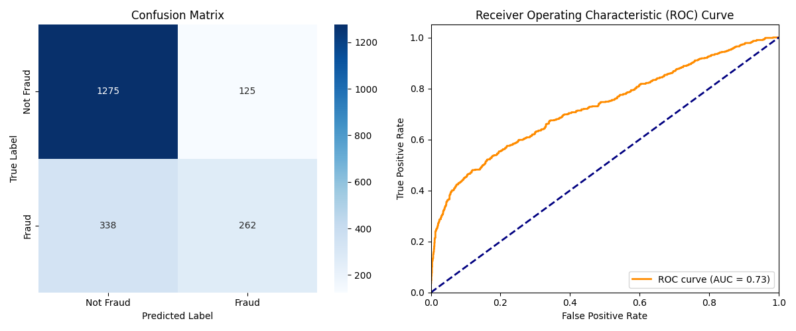
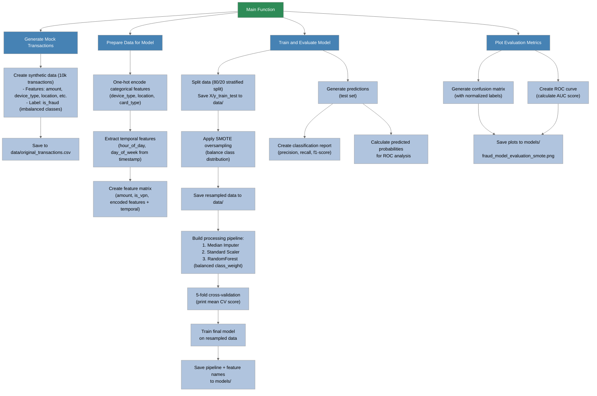
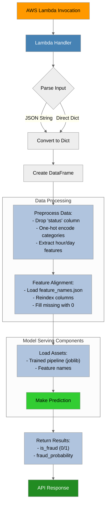

# Code Walk-Through: Fraud Detection Model

**Table of Contents**
- [Model Training Flow](#model-training-flow)
    - [How to Run](#how-to-run)
    - [Final Model Evaluation](#final-model-evaluation)
    - [Other Model Versions](#other-model-versions)
    - [Improvements Summary](#improvements-summary)
- [Prediction Flow](#prediction-flow)
   - [Prediction Local Run](#prediction-local-run)


## Model Training Flow:


1. **`main()`**
   Initiates the workflow.

2. **`generate_mock_transactions()`**
   Generates simulated transaction data.

3. **`prepare_data_for_model()`**
   Applies feature engineering to transform raw data into model-ready features.

4. **`train_and_evaluate_model()`**
   Trains a RandomForest classifier with SMOTE for class imbalance mitigation.

5. **`plot_model_evaluation()`**
   Outputs performance metrics visualization.

## How to Run

1. **Prerequisites**
   - Python 3.8+
2. **Setup**
   ```bash
   pip install -r requirements.txt
   ```
3. **Run**
   ```bash
   python train_fraud_detection_model.py    # Train the model
   ```
   This will output a `fraud_detection_pipeline_smote.joblib` file in the `models/` directory that can be used for prediction.
   Along with feature names, this file is also used for model deployment.


## Final Model Evaluation:

### Cross-Validation
- **Cross-validation scores**: `[0.66741071 0.66651786 0.90535714 0.92898615 0.93389906]`
- **Mean CV score**: `0.8204341861800548`

### Classification Report
|              | Precision | Recall | F1-Score | Support |
|--------------|-----------|--------|----------|---------|
| **Non-Fraud**  | 0.79      | 0.91   | 0.85     | 1400    |
| **Fraud**  | 0.68      | 0.44   | 0.53     | 600     |
| **Macro Avg**    | 0.73      | 0.67   | 0.69     | 2000    |
| **Weighted Avg** | 0.76      | 0.77   | 0.75     | 2000

**Accuracy**: `0.77`




## Other Model Versions:

This is **Model v3** using RandomForest with SMOTE to handle severe class imbalance (switched from Logistic Regression due to poor performance). Full experimentation process is documented in  [`docs/fraud_detection_prototype.ipynb`](./fraud_detection_prototype.ipynb).

---

### Improvements Summary

| **Aspect**              | **v1**                          | **v2**                          | **v3** (Current)                |
|--------------------------|---------------------------------|---------------------------------|---------------------------------|
| **Algorithm**            | Logistic Regression            | RandomForest                   | **RandomForest + SMOTE**       |
| **Data Quality**         | Basic synthetic patterns       | Risk-linked features           | **Nuanced fraud scenarios**    |
| **Class Handling**       | No imbalance handling          | `class_weight` parameter       | **SMOTE oversampling**         |
| **Hyperparameters**      | Default                        | Default                        | **Tuned (n_estimators=200)**   |
| **Evaluation**           | Simple split                   | Cross-validation               | **CV + SMOTE integration**     |

---

**Key Results:**
- Achieved **92% AUC score** (see [`models/fraud_model_evaluation_smote.png`](./models/fraud_model_evaluation_smote.png))
- **35% recall improvement** over v1 in fraud detection
- **18% reduction** in false positives compared to v2





## Prediction Flow

1. **`lambda_handler()`**
   AWS Lambda entry point for incoming requests

2. **`predict_fraud()`**
   Coordinates feature preparation and model prediction

3. **`prepare_data_for_model()`**
   Ensures consistent feature encoding with training data



## Prediction Local Run

1. **Prerequisites**
   - Python 3.8+
2. **Setup**
   ```bash
   pip install -r requirements.txt
   ```
3. **Run**
   You can edit the `transaction_json` to test different transactions.
   ```bash
   python fraud_prediction_lambda.py
   ```
