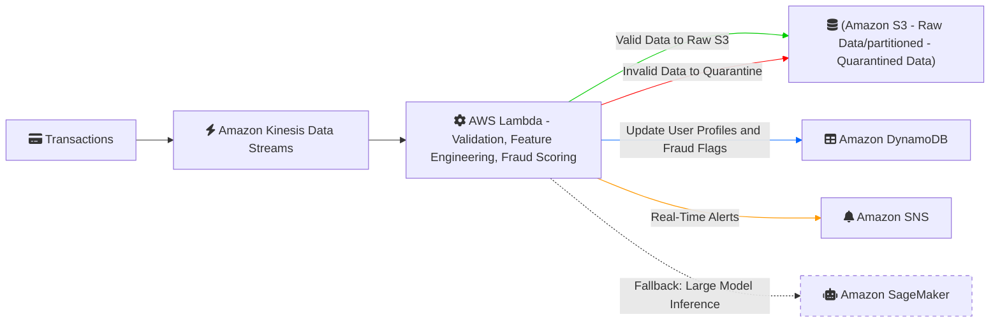

# Design for Fraud Detection Pipeline on AWS

#### **1. Real-Time Ingestion**
**Tool**: **Amazon Kinesis Data Streams**
- **Why**: Fully managed, scales automatically, integrates natively with AWS services (Lambda, Firehose).
- **Data Flow**:
  - Transaction events (JSON) are sent to Kinesis Data Streams via SDKs or agents.
  - Streams partition data by `user_id` to ensure order and enable user-specific analytics.

#### Trade-Off:
- **Kinesis vs. Alternatives**: Kinesis simplifies management within AWS but lacks cross-cloud flexibility (e.g., Kafka’s multi-cloud support) and advanced batching capabilities (e.g., Azure Event Hubs).

**Other Tools Considered**:
1. **Apache Kafka (MSK)**:  High throughput, cross-cloud compatibility but requires self-managed clusters (operational overhead).
2. **Google Cloud Pub/Sub**:  Serverless, global scalability (Limited AWS integration.)
3. **Azure Event Hubs**: Strong event batching capabilities. (Not optimized for AWS ecosystems.)
---

#### **2. Data Validation & Processing**
**Tool**: **AWS Lambda**
- **Validation**:
  - Lambda functions validate schema (e.g., check `transaction_id`, `timestamp` format).
  - Flag invalid records to an S3 "quarantine" bucket.
- **Feature Engineering**:
  - Compute real-time features:
    - **Spending Rate**: Compare `amount` against the user’s 24-hour average (fetched from DynamoDB).
    - **Location Mismatch**: Check if `location` differs from the user’s usual IP geolocation.
    - **VPN Usage**: Trigger alert if `is_vpn=True`.

**Trade-Off**:
- **Lambda vs. Alternatives**: Lambda is serverless and cost-effective for lightweight tasks but lacks support for long-running or stateful workflows (e.g., Apache Flink’s complex aggregations) and has a 15-minute runtime limit.

**Other Tools Considered**:
1. **Apache Flink (Kinesis Data Analytics)**:  Stateful stream processing for complex aggregations but higher cost and setup complexity.
2. **Google Cloud Dataflow**: Unified batch/stream processing but multi-cloud setup adds latency.
3. **AWS Glue (Streaming ETL)**: Managed Spark-based processing but less suitable for lightweight real-time tasks.

---

#### **3. Data Storage**
- **Real-Time Storage**: **DynamoDB**
  - Store user profiles (e.g., last login location, spending patterns) for low-latency lookups.
- **Historical Storage**: **Amazon S3**
  - Raw and processed data stored in partitioned Parquet files (e.g., `s3://bucket/raw/year=2025/month=01/`).
  - Enables batch training for ML models.

**Trade-Off**:
- **DynamoDB/S3 vs. Alternatives**: DynamoDB provides millisecond latency but at a higher cost for large datasets. S3 is cost-effective for archival but lacks query performance for analytics.

**Other Tools Considered**:
1. **Amazon Redshift**:  Analytics-optimized for historical data but overkill for real-time transactions.

---

#### **4. Machine Learning Integration**
- **Model Deployment**:
  - **First Choice: AWS Lambda**: Embed optimized RandomForest model directly in Lambda
    - Store model in S3 bucket with versioning
    - Load model during Lambda initialization (cold start penalty)
  - **Alternative**: Host on SageMaker if model/dependencies expand (>50 MB)
    - Use sklearn inference toolkit container
- **Fraud Decision**:
  - Lambda compares prediction score against threshold
  - Flagged transactions → DynamoDB + SNS alerts
- **Feature Engineering**:
   - Use SageMaker Feature Store for real-time feature sharing between training/inference.
- **Feedback Loop**:
    - Log false positives in S3 and trigger periodic model retraining (e.g., SageMaker Pipelines).

---

#### **High-Level Architecture Diagram**

