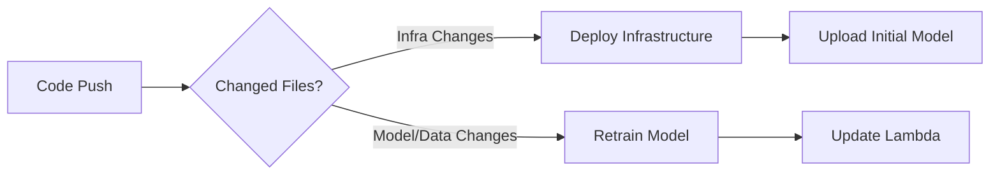

# Infrastructure & Deployment Guide

## Infrastructure Setup (Terraform)

### Architecture Overview

Managed through `infra/` directory:
```
infra/
├── main.tf          # Core resource definitions
├── variables.tf     # Configuration parameters
└── outputs.tf       # Resource references
```

### Key Components
| Resource          | Purpose                                                                 |
|-------------------|-------------------------------------------------------------------------|
| AWS Kinesis       | Real-time transaction ingestion stream                                 |
| AWS Lambda        | Data validation, feature engineering, and fraud prediction             |
| Amazon S3         | - Raw/quarantined data storage<br>- Model artifact storage (versioned) |
| DynamoDB          | User profile storage for real-time lookups                             |
| SNS               | Fraud alert notifications                                              |

### Manual Deployment Process
1. **Prerequisites**:
   - Terraform v1.5.0+
   - AWS credentials with appropriate permissions

2. **Deploy**:
   ```bash
   cd infra/
   terraform init
   terraform apply
   ```

3. **Auto-Provisioned Resources**:
   - 3 S3 buckets (raw data, quarantine, models)
   - DynamoDB table for user profiles
   - Lambda function with Python dependencies layer
   - SNS topic for alerts
   - IAM roles with least-privilege permissions

## 🔄 CI/CD Pipeline (GitHub Actions)

### Workflow Overview
`.github/workflows/deploy.yml` triggers on pushes to `main` branch:



### Key Stages
1. **Infrastructure Deployment**:
   - Creates Python Lambda layer from `requirements.txt`
   - Provisions AWS resources via Terraform
   - Uploads initial model to S3
   - Runs on **any code change** except docs/notebooks

2. **Model Training**:
   - Triggers only when `models/` or `data/` changes
   - Trains new model using `train_fraud_detection_model.py`
   - Uploads updated model to S3
   - Updates Lambda function automatically
